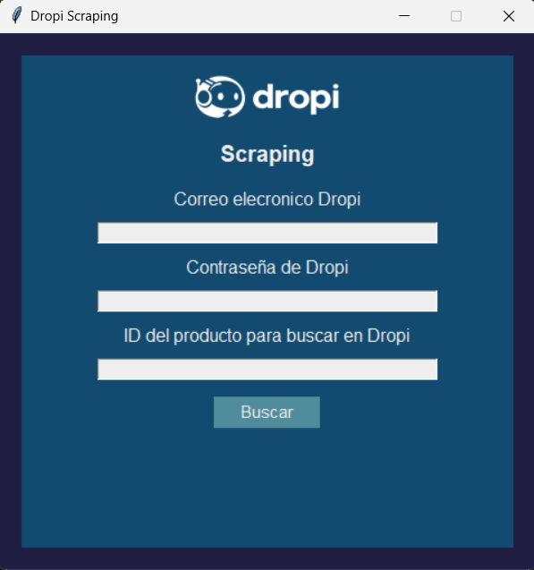
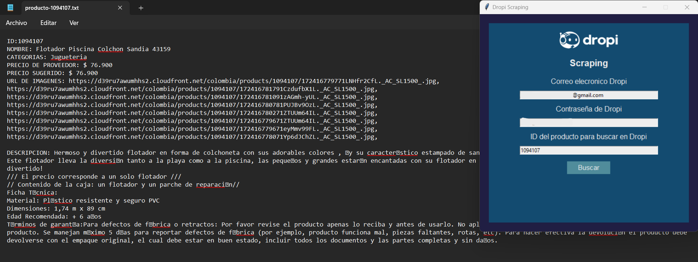

# Bot de web scraping para Dropi 🤖

Usando el lenguaje Python y la librería Selenium, he creado este bot automático que puede extraer información de un producto de la plataforma de Dropi. Para facilitar su uso, he creado una interfaz gráfica simple utilizando la librería Tkinter.

##### Cómo usar:

* Ejecutar el archivo `main.pyw` para iniciar la aplicación.
* Ingresar los datos requeridos:
  - Correo electrónico de la cuenta en Dropi.
  - Contraseña de la cuenta Dropi.
  - Ingresar el ID del producto para extraer la información.
* Importente: `chrome version 127.0.6533`
##### ¿Dónde se guarda la información?
La información se guarda en un archivo de texto en el escritorio:
- `producto-(id).txt`

#### Screenshots

    

    

    

